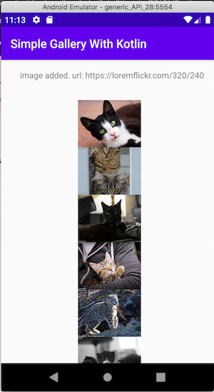

# simple-gallery-in-kotlin

Very simple gallery app for android made in kotlin.

It looks like this:

It sends request to server and get images list (json).
After that it shows images in vertical layout.

# todo
- scrolling
- grid layout
